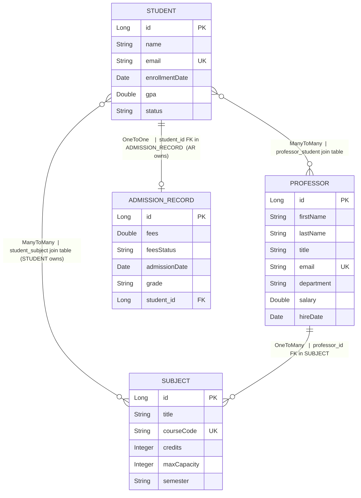

# SchoolSys — Production-Style School Management REST API


---

## Overview

SchoolSys is a fully relational school management REST API built on Spring Boot 4 and Spring Data JPA, modelling real academic domain relationships: professors teach subjects, students enroll in them, and admission records track financial standing. The system solves a common backend engineering challenge — managing complex bidirectional entity graphs without lazy-loading traps, orphaned rows, or inconsistent join-table state. It demonstrates production-style JPA patterns across 30+ endpoint paths organized in four tiers of complexity, from basic CRUD to paginated + sorted queries driven by whitelisted `Pageable` sorts and JPQL aggregations with `COUNT DISTINCT`.

---

## Tech Stack

| Technology | Version | Purpose |
|---|---|---|
| Java | 21 | Language runtime; record types used for all DTOs |
| Spring Boot | 4.0.5 | Application framework, auto-configuration, embedded Tomcat |
| Spring Data JPA | (managed by Boot) | Repository abstraction, derived queries, Pageable |
| Hibernate | (managed by Boot) | JPA provider, DDL generation, query translation |
| PostgreSQL | (Neon serverless) | Primary database; `school` schema |
| MapStruct | 1.6.3 | Compile-time DTO↔Entity mapping with `@BeanMapping` for PATCH semantics |
| Lombok | (managed by Boot) | Boilerplate reduction; `@FieldDefaults` enforces field-level access control |
| SpringDoc OpenAPI | 3.0.3 | Auto-generated Swagger UI from controller annotations |
| Spring Actuator | (managed by Boot) | Production health and metrics endpoints |
| Maven | 3.x | Build tool; annotation processor ordering for Lombok + MapStruct |

---

## Architecture

```
HTTP Request
    │
    ▼
┌──────────────────────────────────┐
│         Controller Layer         │  Route, deserialize, validate params; return ResponseEntity<Page<DTO>>
└──────────────┬───────────────────┘
               │
    ▼
┌──────────────────────────────────┐
│          Service Layer           │  Business logic, PageRequest construction, sort whitelisting, @Transactional
│    interface + impl pattern      │
└──────────────┬───────────────────┘
               │
    ▼
┌──────────────────────────────────┐
│        Repository Layer          │  JpaRepository + derived queries + @Query JPQL; Spring Data generates SQL
└──────────────┬───────────────────┘
               │
    ▼
┌──────────────────────────────────┐
│     PostgreSQL (Neon, TLS)       │  school schema; sequences for all PKs; join tables managed by JPA
└──────────────────────────────────┘
```

**Controller** — accepts and validates request parameters, delegates all logic to the service, maps results to HTTP responses.  
**Service** — owns business rules, builds `PageRequest` objects, enforces entity-level invariants (e.g. duplicate enrollment), wraps multi-step operations in `@Transactional`.  
**Repository** — pure data access; derived query methods and `@Query` JPQL; no business logic.  
**Database** — all schema managed by `spring.jpa.hibernate.ddl-auto=update`; Neon provides serverless PostgreSQL with connection pooling.

---

## Entity Relationship



---

## JPA Concepts Demonstrated

### 1. All Four Relationship Types

**OneToOne — Student ↔ AdmissionRecord**
```java
// Student.java — inverse side
@OneToOne(mappedBy = "student", cascade = CascadeType.ALL, orphanRemoval = true)
AdmissionRecord admissionRecord;

// AdmissionRecord.java — owning side (holds the FK)
@OneToOne
@JoinColumn(name = "student_id")
Student student;
```

**OneToMany / ManyToOne — Professor ↔ Subject**
```java
// Professor.java — one professor teaches many subjects
@OneToMany(mappedBy = "professor", cascade = {CascadeType.MERGE, CascadeType.PERSIST})
List<Subject> subjects;

// Subject.java — many subjects belong to one professor
@ManyToOne
@JoinColumn(name = "professor_id")
Professor professor;
```

**ManyToMany — Student ↔ Subject (owning side on Student)**
```java
// Student.java — owning side; controls the join table
@ManyToMany
@JoinTable(name = "student_subject")
Set<Subject> subjects = new HashSet<>();

// Subject.java — inverse side
@ManyToMany(mappedBy = "subjects")
Set<Student> students = new HashSet<>();
```

**ManyToMany — Professor ↔ Student (owning side on Professor)**
```java
// Professor.java — owning side
@ManyToMany
@JoinTable(name = "professor_student")
Set<Student> students = new HashSet<>();

// Student.java — inverse side
@ManyToMany(mappedBy = "students")
Set<Professor> professors = new HashSet<>();
```

---

### 2. CascadeType and orphanRemoval

`CascadeType.ALL` with `orphanRemoval = true` is applied **only** on the `Student → AdmissionRecord` relationship. This means creating/deleting a `Student` automatically propagates to their `AdmissionRecord` — no manual coordination required. Using `ALL` on the bidirectional many-to-many sides would cause unintended deletes when removing from a collection, so those use narrower cascade types (`MERGE`, `PERSIST`).

```java
// Student.java
@OneToOne(mappedBy = "student", cascade = CascadeType.ALL, orphanRemoval = true)
AdmissionRecord admissionRecord;
```

The service correctly sets both sides of the link before saving:
```java
admissionRecord.setStudent(student);
student.setAdmissionRecord(admissionRecord);
studentRepository.save(student);   // cascade saves AdmissionRecord
```

---

### 3. FetchType — JOIN FETCH on Transcript Endpoint

All collection associations default to `FetchType.LAZY`. The transcript endpoint needs professors, subjects, and the admission record in one response — three separate collections. Calling `studentRepository.findById()` and then accessing those collections would generate **four SQL queries** (N+1). Instead, a single `@Query` with `LEFT JOIN FETCH` loads everything in one round-trip:

```java
// StudentRepository.java
@Query("""
SELECT DISTINCT s FROM Student s
LEFT JOIN FETCH s.professors
LEFT JOIN FETCH s.subjects
LEFT JOIN FETCH s.admissionRecord
WHERE s.id = :id""")
Optional<Student> findStudentWithFullProfile(@Param("id") Long id);
```

`DISTINCT` is required because Hibernate may duplicate the root entity row during join expansion.

---

### 4. Derived Query Methods

Spring Data JPA translates method names directly to SQL at application startup. Three examples from the repositories:

```java
// StudentRepository — equality filter on enum column
List<Student> findByStatus(StudentStatus status);
Page<Student> findByStatus(StudentStatus status, Pageable pageable);

// StudentRepository — comparison operator
Page<Student> findByGpaGreaterThanEqual(Double gpa, Pageable pageable);

// AdmissionRecordRepository — filter on enum
List<AdmissionRecord> findAdmissionRecordsByFeesStatus(FeesStatus feesStatus);
```

---

### 5. @Query with JPQL

Three examples across repositories:

```java
// StudentRepository — LIMIT via JPQL
@Query("SELECT s FROM Student s ORDER BY s.gpa DESC LIMIT :limit")
List<Student> findTopStudentsByGpa(@Param("limit") int limit);

// SubjectRepository — computed business logic in JPQL (SIZE function)
@Query("SELECT s FROM Subject s WHERE SIZE(s.students) < s.maxCapacity ORDER BY s.id")
List<Subject> findAvailableSubjects();

// ProfessorRepository — aggregation with GROUP BY and COUNT DISTINCT
// Returns DTO projection using the `new` keyword (constructor expression)
@Query("""
SELECT new dev.darshan.schoolsys.dto.DepartmentSummaryResponse(
    p.department,
    COUNT(DISTINCT p.id),
    COUNT(DISTINCT st.id),
    COUNT(DISTINCT s.id)
)
FROM Professor p
LEFT JOIN p.students st
LEFT JOIN p.subjects s
GROUP BY p.department""")
List<DepartmentSummaryResponse> findDepartmentSummary();
```

---

### 6. Pageable and Sorting with Sort Field Whitelisting

The controller accepts `page`, `size`, `sortBy`, and `direction` parameters with safe defaults. The service builds `PageRequest` and uses a whitelisted set of sort fields to prevent Hibernate from receiving arbitrary column names (which would throw a `PropertyReferenceException`):

```java
// StudentServiceImpl.java
private static final Set<String> ALLOWED_SORT_FIELDS =
        Set.of("id", "name", "gpa", "status", "enrollmentDate");

private Sort buildSort(String sortBy, String direction) {
    String field = ALLOWED_SORT_FIELDS.contains(sortBy) ? sortBy : "id";
    return direction.equalsIgnoreCase("desc")
            ? Sort.by(field).descending()
            : Sort.by(field).ascending();
}

public Page<StudentDto> getAllStudents(int page, int size, String sortBy, String direction) {
    PageRequest pageable = PageRequest.of(page, size, buildSort(sortBy, direction));
    return studentRepository.findAll(pageable).map(studentMapper::toStudentDto);
}
```

Filter and pagination are composable — when a filter param is present, the paginated repository overload is used; otherwise, `findAll(Pageable)` is used.

---

### 7. DTO Projection Using the `new` Keyword in JPQL

The `DepartmentSummaryResponse` is populated entirely inside the database query — no entity loading, no collection traversal:

```java
// JPQL constructor expression — Hibernate calls the record's compact constructor
SELECT new dev.darshan.schoolsys.dto.DepartmentSummaryResponse(
    p.department,
    COUNT(DISTINCT p.id),
    COUNT(DISTINCT st.id),
    COUNT(DISTINCT s.id)
)
FROM Professor p
LEFT JOIN p.students st
LEFT JOIN p.subjects s
GROUP BY p.department
```

```java
// DepartmentSummaryResponse.java — Java record used as projection target
public record DepartmentSummaryResponse(
    String department,
    Long professorCount,
    Long studentCount,
    Long subjectCount
) {}
```

---

### 8. MapStruct with @BeanMapping for PATCH Semantics

Each mapper has both a full-conversion method and a selective update method. The `@BeanMapping(nullValuePropertyMappingStrategy = NullValuePropertyMappingStrategy.IGNORE)` annotation causes MapStruct to skip null DTO fields, implementing PATCH behaviour without a custom mapper:

```java
// ProfessorMapper.java
@Mapper(componentModel = "spring")
public interface ProfessorMapper {
    ProfessorDto toProfessorDto(Professor professor);
    Professor toProfessor(ProfessorDto professorDto);

    @BeanMapping(nullValuePropertyMappingStrategy = NullValuePropertyMappingStrategy.IGNORE)
    void updateProfessorFromDto(ProfessorDto dto, @MappingTarget Professor professor);
}
```

`AdmissionRecordMapper` additionally uses `@Mapping(target = "studentId", source = "student.id")` to flatten the nested student relationship into the DTO, and `unmappedTargetPolicy = ReportingPolicy.IGNORE` to suppress compile-time warnings for fields not present in the DTO.

---

### 9. Jakarta Validation on DTOs

`MethodArgumentNotValidException` is handled globally. The `GlobalExceptionHandler` catches it and returns a field-keyed map of validation messages, making client-side error handling straightforward.

---

### 10. Global Exception Handling with @RestControllerAdvice

A single `GlobalExceptionHandler` centralizes all error responses, keeping controllers free of try/catch blocks:

```java
@RestControllerAdvice
public class GlobalExceptionHandler {

    @ExceptionHandler(ResourceNotFoundException.class)   // 404 — entity not found by ID
    @ExceptionHandler(BusinessException.class)           // 400 — domain rule violation (duplicate enrollment, etc.)
    @ExceptionHandler(MethodArgumentNotValidException.class) // 400 — @Valid constraint failures, field-keyed map
    @ExceptionHandler(Exception.class)                   // 500 — catch-all, hides internals
}
```

All error responses use the `ApiErrorResponse` record:

```java
public record ApiErrorResponse(
    HttpStatusCode status,
    String error,
    String message,
    LocalDateTime timestamp
) {}
```

---

## API Endpoints

Base URL: `http://localhost:8080/api/v1`

### Tier 1 — CRUD Foundations
> Basic persistence: `@Entity`, `@Id`, `@GeneratedValue`, `JpaRepository`

| Method | Endpoint | Description | JPA Concept |
|---|---|---|---|
| POST | `/students` | Create a student | `@Entity`, sequence ID generation |
| GET | `/students/{id}` | Get student by ID | `findById`, `Optional` unwrap |
| DELETE | `/students/{id}` | Delete student (cascades admission record) | `deleteById` |
| POST | `/professors` | Create a professor | Sequence ID, `@Column(unique)` |
| GET | `/professors/{id}` | Get professor by ID | Basic lookup |
| PUT | `/professors/{id}` | Update professor fields | Dirty checking + `@BeanMapping` PATCH |
| DELETE | `/professors/{id}` | Delete professor | `deleteById` |
| POST | `/subjects` | Create a subject | Basic CRUD |
| POST | `/admissions` | Create admission record linked to student | `@OneToOne`, cascaded save |

### Tier 2 — Relationship Mappings and Assignments
> Bidirectional consistency: owning side, inverse side, join tables

| Method | Endpoint | Description | JPA Concept |
|---|---|---|---|
| PUT | `/students/{subjectId}/enroll/{studentId}` | Enroll student into subject | `@ManyToMany` owning side update |
| DELETE | `/students/{studentId}/subjects/{subjectId}` | Unenroll student from subject | Collection removal, both sides |
| GET | `/students/{studentId}/subjects` | All subjects a student is enrolled in | Lazy collection traversal |
| PUT | `/professors/{id}/subjects/{subjectId}` | Assign subject to professor | `@ManyToOne`, FK set on owning side |
| GET | `/professors/{profId}/students` | All students under a professor | Inverse collection traversal |
| GET | `/admissions` | List all admission records | `findAll` |
| GET | `/admissions?feesStatus=UNPAID` | Filter records by fees status | `findAdmissionRecordsByFeesStatus` |

### Tier 3 — Dynamic Query Methods and Filtering
> Derived queries, JPQL, aggregation

| Method | Endpoint | Description | JPA Concept |
|---|---|---|---|
| GET | `/students?status=ACTIVE` | Filter students by enrollment status | `findByStatus(StudentStatus, Pageable)` |
| GET | `/students?gpa=3.5` | Students with GPA at or above threshold | `findByGpaGreaterThanEqual` |
| GET | `/professors?department=Engineering` | Professors in a department | `findByDepartment(String, Pageable)` |
| GET | `/subjects?semester=Fall2025` | Subjects for a given semester | `getSubjectsBySemester(String, Pageable)` |
| GET | `/students/top?limit=5` | Top N students by GPA | `@Query` with JPQL `ORDER BY` + `LIMIT` |
| GET | `/professors/{id}/subjects/count` | Subject count + list for a professor | Derived `countSubjectByProfessor_Id` |
| GET | `/subjects/available` | Subjects not yet at max capacity | `@Query` with JPQL `SIZE()` function |
| GET | `/professors/department-summary` | Professor, student, subject counts by dept | `@Query` with `GROUP BY`, `COUNT DISTINCT`, constructor expression |
| GET | `/students/{id}/transcript` | Full student profile in one query | `@Query` with `LEFT JOIN FETCH`, `DISTINCT` |

### Tier 4 — Pagination and Sorting
> `Pageable`, `PageRequest`, `Sort`, whitelisted sort fields, `Page<T>` response envelope

| Method | Endpoint | Description | JPA Concept |
|---|---|---|---|
| GET | `/students?page=0&size=10&sortBy=gpa&direction=desc` | Paginated student list with optional filter | `PageRequest.of(page, size, Sort)` |
| GET | `/students?status=ACTIVE&page=0&size=5&sortBy=name&direction=asc` | Filtered + paginated students | `findByStatus(status, Pageable)` |
| GET | `/students?gpa=3.5&page=0&size=5&sortBy=gpa&direction=desc` | GPA-filtered + paginated | `findByGpaGreaterThanEqual(gpa, Pageable)` |
| GET | `/professors?page=0&size=10&sortBy=salary&direction=desc` | Paginated professors | `findAll(Pageable)` |
| GET | `/professors?department=CS&page=0&size=5&sortBy=lastName&direction=asc` | Filtered + paginated professors | `findByDepartment(String, Pageable)` |
| GET | `/subjects?page=0&size=10&sortBy=credits&direction=desc` | Paginated subjects | `findAll(Pageable)` |
| GET | `/subjects?semester=Fall2025&page=0&size=5&sortBy=title&direction=asc` | Filtered + paginated subjects | `getSubjectsBySemester(String, Pageable)` |

**Allowed sort fields per entity:**
- Students: `id`, `name`, `gpa`, `status`, `enrollmentDate`
- Professors: `id`, `firstName`, `lastName`, `salary`, `department`, `hireDate`
- Subjects: `id`, `title`, `credits`, `maxCapacity`, `semester`

Invalid `sortBy` values silently fall back to `id` — no 400 error exposed to clients.

---

## Request & Response Examples

### POST /api/v1/students — Create a Student

```bash
curl -X POST http://localhost:8080/api/v1/students \
  -H "Content-Type: application/json" \
  -d '{
    "name": "Alice Mercer",
    "email": "alice@university.edu",
    "enrollmentDate": "2024-09-01",
    "gpa": 3.85,
    "status": "ACTIVE"
  }'
```

**Response — 201 Created**
```json
{
  "id": 12,
  "name": "Alice Mercer",
  "email": "alice@university.edu",
  "enrollmentDate": "2024-09-01",
  "gpa": 3.85,
  "status": "ACTIVE"
}
```

---

### POST /api/v1/professors — Create a Professor

```bash
curl -X POST http://localhost:8080/api/v1/professors \
  -H "Content-Type: application/json" \
  -d '{
    "firstName": "Alan",
    "lastName": "Turing",
    "title": "Dr.",
    "email": "turing@university.edu",
    "department": "Computer Science",
    "salary": 94000.00,
    "hireDate": "2019-08-15"
  }'
```

**Response — 201 Created**
```json
{
  "id": 4,
  "firstName": "Alan",
  "lastName": "Turing",
  "title": "Dr.",
  "email": "turing@university.edu",
  "department": "Computer Science",
  "salary": 94000.0,
  "hireDate": "2019-08-15"
}
```

---

### POST /api/v1/subjects — Create a Subject

```bash
curl -X POST http://localhost:8080/api/v1/subjects \
  -H "Content-Type: application/json" \
  -d '{
    "title": "Algorithms and Complexity",
    "courseCode": "CS401",
    "credits": 4,
    "maxCapacity": 40,
    "semester": "Fall2025"
  }'
```

**Response — 201 Created**
```json
{
  "id": 7,
  "title": "Algorithms and Complexity",
  "courseCode": "CS401",
  "credits": 4,
  "maxCapacity": 40,
  "semester": "Fall2025"
}
```

---

### POST /api/v1/admissions — Create an Admission Record

```bash
curl -X POST http://localhost:8080/api/v1/admissions \
  -H "Content-Type: application/json" \
  -d '{
    "studentId": 12,
    "fees": 12500.00,
    "feesStatus": "PARTIAL",
    "admissionDate": "2024-09-01",
    "grade": "A"
  }'
```

**Response — 201 Created**
```json
{
  "id": 5,
  "fees": 12500.0,
  "feesStatus": "PARTIAL",
  "admissionDate": "2024-09-01",
  "studentId": 12,
  "grade": "A"
}
```

---

### GET /api/v1/students/{id}/transcript — Full Profile (JOIN FETCH)

```bash
curl http://localhost:8080/api/v1/students/12/transcript
```

**Response — 200 OK**
```json
{
  "student": {
    "id": 12,
    "name": "Alice Mercer",
    "email": "alice@university.edu",
    "enrollmentDate": "2024-09-01",
    "gpa": 3.85,
    "status": "ACTIVE"
  },
  "professors": [
    { "id": 4, "firstName": "Alan", "lastName": "Turing", "department": "Computer Science", ... }
  ],
  "subjects": [
    { "id": 7, "title": "Algorithms and Complexity", "courseCode": "CS401", "credits": 4, ... }
  ],
  "admissionRecord": {
    "id": 5,
    "fees": 12500.0,
    "feesStatus": "PARTIAL",
    "admissionDate": "2024-09-01",
    "studentId": 12,
    "grade": "A"
  }
}
```

---

### Paginated Response Envelope

```bash
curl "http://localhost:8080/api/v1/students?page=0&size=2&sortBy=gpa&direction=desc"
```

**Response — 200 OK**  
Spring Data's `Page<T>` is serialized into this standard envelope automatically:
```json
{
  "content": [
    { "id": 12, "name": "Alice Mercer", "gpa": 3.85, "status": "ACTIVE", ... },
    { "id": 8,  "name": "Bob Chen",     "gpa": 3.72, "status": "ACTIVE", ... }
  ],
  "pageable": {
    "pageNumber": 0,
    "pageSize": 2,
    "sort": { "sorted": true, "direction": "DESC", "property": "gpa" }
  },
  "totalElements": 24,
  "totalPages": 12,
  "last": false,
  "first": true,
  "numberOfElements": 2,
  "empty": false
}
```

---

### Error Response — Resource Not Found

```bash
curl http://localhost:8080/api/v1/students/999
```

**Response — 404 Not Found**
```json
{
  "status": 404,
  "error": "Not Found",
  "message": "Student Not Found With id: 999",
  "timestamp": "2025-05-11T14:32:07.123"
}
```

### Error Response — Business Rule Violation

```bash
curl -X PUT http://localhost:8080/api/v1/students/3/enroll/12
# (student 12 already enrolled in subject 3)
```

**Response — 400 Bad Request**
```json
{
  "status": 400,
  "error": "Bad Request",
  "message": "Student is already enrolled in this subject",
  "timestamp": "2025-05-11T14:33:15.456"
}
```

---

## Swagger UI

Access the full interactive API documentation at:

```
http://localhost:8080/swagger-ui/index.html
```

The API spec is also available in raw JSON at:

```
http://localhost:8080/v3/api-docs
```

SpringDoc OpenAPI scans all `@RestController` classes at startup and generates a live Swagger UI — non-technical staff can browse endpoints, read parameter descriptions, and try requests without writing any curl commands.

---

## Spring Actuator

Spring Boot Actuator exposes production observability endpoints on the same port. The following are available by default:

| Endpoint | URL | What It Shows |
|---|---|---|
| Health | `/actuator/health` | Application liveness + DB connectivity status |
| Info | `/actuator/info` | Build metadata, application name |

To expose additional endpoints (metrics, environment, beans), add to `application.properties`:

```properties
management.endpoints.web.exposure.include=health,info,metrics,env,beans
```

Actuator matters in production because it provides the health check endpoint that load balancers and container orchestrators (Kubernetes liveness/readiness probes) ping to know whether traffic should be routed to this instance.

---

## Setup & Run

### Prerequisites

- Java 21+
- Maven 3.8+ (or use the included `./mvnw`)
- PostgreSQL database (local or Neon)

### 1. Clone the repository

```bash
git clone https://github.com/thedarshannn/SchoolSys.git
cd SchoolSys
```

### 2. Configure the database

Edit `src/main/resources/application.properties`:

```properties
spring.datasource.url=jdbc:postgresql://localhost:5432/schooldb?currentSchema=school
spring.datasource.username=postgres
spring.datasource.password=yourpassword
spring.datasource.driver-class-name=org.postgresql.Driver

spring.jpa.hibernate.ddl-auto=update
spring.jpa.properties.hibernate.default_schema=school
spring.jpa.show-sql=true
spring.jpa.properties.hibernate.format_sql=true
```

If using Neon, set the password via environment variable to keep credentials out of source control:

```bash
export DB_PASSWORD=your_neon_password
```

### 3. Build

```bash
./mvnw clean package -DskipTests
```

### 4. Run

```bash
./mvnw spring-boot:run
```

Or run the packaged JAR:

```bash
java -jar target/SchoolSys-0.0.1-SNAPSHOT.jar
```

### 5. Verify

```bash
# Health check
curl http://localhost:8080/actuator/health

# Swagger UI
open http://localhost:8080/swagger-ui/index.html

# First paginated request
curl "http://localhost:8080/api/v1/students?page=0&size=5&sortBy=id&direction=asc"
```

---

## Project Structure

```
src/
└── main/
    ├── java/dev/darshan/schoolsys/
    │   │
    │   ├── SchoolSysApplication.java          # Entry point — @SpringBootApplication
    │   │
    │   ├── controller/                        # HTTP layer: routing, param binding, ResponseEntity
    │   │   ├── StudentController.java
    │   │   ├── ProfessorController.java
    │   │   ├── SubjectController.java
    │   │   └── AdmissionRecordController.java
    │   │
    │   ├── service/                           # Business interfaces (dependency inversion)
    │   │   ├── StudentService.java
    │   │   ├── ProfessorService.java
    │   │   ├── SubjectService.java
    │   │   └── AdmissionRecordService.java
    │   │
    │   ├── service/impl/                      # Business implementations; @Transactional boundaries
    │   │   ├── StudentServiceImpl.java
    │   │   ├── ProfessorServiceImpl.java
    │   │   ├── SubjectServiceImpl.java
    │   │   └── AdmissionRecordServiceImpl.java
    │   │
    │   ├── repository/                        # Spring Data JPA repositories; derived + @Query methods
    │   │   ├── StudentRepository.java
    │   │   ├── ProfessorRepository.java
    │   │   ├── SubjectRepository.java
    │   │   └── AdmissionRecordRepository.java
    │   │
    │   ├── entity/                            # JPA entities; relationship annotations; @FieldDefaults
    │   │   ├── Student.java
    │   │   ├── Professor.java
    │   │   ├── Subject.java
    │   │   └── AdmissionRecord.java
    │   │
    │   ├── dto/                               # Java records; immutable, serializable data contracts
    │   │   ├── StudentDto.java
    │   │   ├── ProfessorDto.java
    │   │   ├── SubjectDto.java
    │   │   ├── AdmissionRecordDto.java
    │   │   ├── TranscriptResponse.java        # Composite response: student + professors + subjects + AR
    │   │   ├── AvailableSubjectResponse.java  # Derived fields: enrolledCount, spotsRemaining
    │   │   ├── DepartmentSummaryResponse.java # JPQL constructor expression target
    │   │   └── SubjectCountResponse.java
    │   │
    │   ├── mapper/                            # MapStruct interfaces; compile-time generated impls
    │   │   ├── StudentMapper.java
    │   │   ├── ProfessorMapper.java
    │   │   ├── SubjectMapper.java
    │   │   └── AdmissionRecordMapper.java     # Cross-entity mapping: studentId ← student.id
    │   │
    │   ├── enums/
    │   │   ├── StudentStatus.java             # ACTIVE | SUSPENDED | GRADUATED
    │   │   └── FeesStatus.java                # PAID | PARTIAL | UNPAID
    │   │
    │   └── advice/                            # Cross-cutting: exception handling
    │       ├── GlobalExceptionHandler.java    # @RestControllerAdvice; 4 handlers
    │       ├── ApiErrorResponse.java          # Error response record (status, error, message, timestamp)
    │       └── exception/
    │           ├── ResourceNotFoundException.java  # 404 — entity not found
    │           └── BusinessException.java          # 400 — domain rule violation
    │
    └── resources/
        └── application.properties             # DB connection, JPA settings, schema config
```

---

## Design Decisions

- **`Set<>` over `List<>` on all ManyToMany collections.** Hibernate maps `List` with a join table using an implicit index column that causes extra UPDATE statements on reorder. `Set` treats the join table purely as an unordered bag of foreign keys — one INSERT per enrollment, no index maintenance overhead. It also naturally prevents duplicate enrollments at the collection level.

- **`CascadeType.ALL` exclusively on the `Student → AdmissionRecord` OneToOne.** An admission record has no meaningful existence outside of its student — it is a dependent entity. `ALL` (including `REMOVE`) reflects that. The ManyToMany sides use only `{MERGE, PERSIST}` because deleting a professor must not cascade to their students or subjects, which belong to independent aggregates.

- **Sort field whitelisting in the service layer, not the controller.** Passing an arbitrary string from a query parameter directly to `Sort.by()` causes Hibernate to embed it in the ORDER BY clause. An invalid field name throws a `PropertyReferenceException` at query time. The whitelist in each `ServiceImpl` validates the field against a known-good `Set<String>` and silently defaults to `"id"` — safe, predictable, no exposure of internal field names in error messages.

- **`@Transactional` on multi-step service methods only.** `assignSubjectToStudent`, `unenrollStudentFromSubject`, `addAdmissionRecord`, and the assignment methods perform multiple repository operations that must succeed or fail atomically. Single-read/single-write methods are left non-transactional — Spring's default connection-per-operation is sufficient and avoids holding connections open unnecessarily.

- **`LEFT JOIN FETCH` with `DISTINCT` on the transcript endpoint.** Fetching a student's professors, subjects, and admission record as three separate lazy loads inside a single request generates four database round-trips. The custom `@Query` collapses this into one SQL JOIN, at the cost of a slightly wider result set. `DISTINCT` prevents Hibernate from returning duplicate `Student` root objects when the join multiplies rows.

- **Java records for all DTOs.** Records are immutable by design, implement `equals`/`hashCode`/`toString` for free, and make the data contract explicit in the constructor signature. They require no Lombok annotations and map cleanly with both Jackson and MapStruct. `Serializable` is implemented explicitly on the core DTOs to support future caching layers.

- **Service interface + implementation split.** Every service is defined as an interface with a single `@Service` implementation. This is not over-engineering: it allows the controller to depend on the abstraction, makes mock injection in tests trivial, and keeps Spring's `@Transactional` AOP proxy working correctly (Spring proxies the interface, not the concrete class).

---

## Author

**Darshan Prajapati**

- GitHub: [@thedarshannn](https://github.com/thedarshannn)
- LinkedIn: [darshan-prajapati29](https://linkedin.com/in/darshan-prajapati29)
- Portfolio: [darshan-agency.vercel.app](https://darshan-agency.vercel.app)
